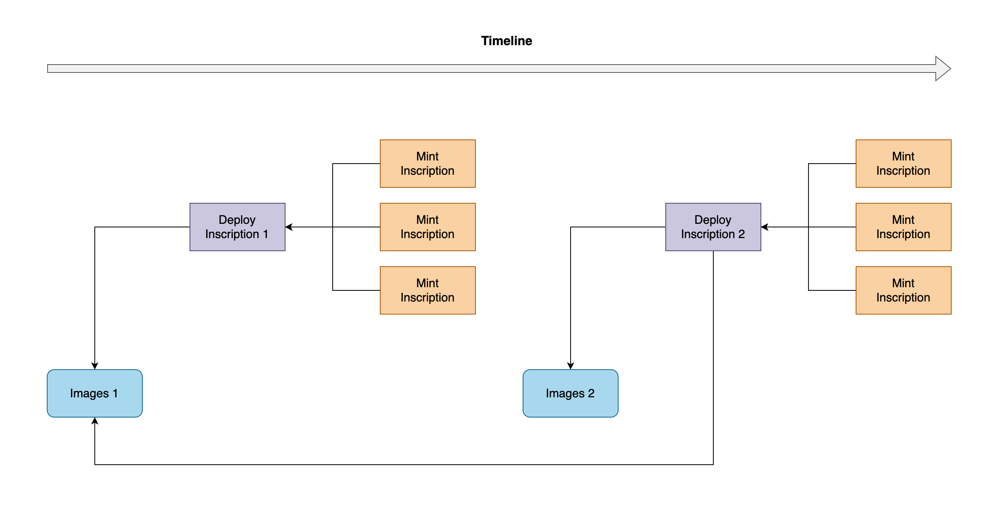

# Composable BRC-721 (CRC-721)

**TLDR**: 本 proposal 提出的 Composable BRC-721 (CRC-721) 标准主要是为 Ordinal NFT 生态系统带来以下能力：

* 可组合性
* 可以为同一个合集的 NFT 分配不同角色
* 自由度更高的客制化
* 创作权利下放到用户
* 创作素材可复用性
* 缩减链上交易成本

# Background

在 Ordinal Theory 的支持下，我们被允许在 Bitcoin Chain 上面铸造 NFT。但是由于交易活动频繁，链上交易成本也逐渐增高。BRC-721 协议提议将图片存到链下，通过 Url 引用的到第三方平台。不过其缺陷是第三方平台存在不可用，不可访问的风险。GBRC-721 为了解决该问题，提议将图片的组件存储到链上，然后在 mint 的时候记录如何将这些组件拼接成完整图片的信息。这样就大幅度降低了 mint 过程的交易费用。基于 GBRC-721，ORC-721 采取了更加简洁的 Json 格式，从而缩小了 Json 文件大小，进一步降低了交易费用。

不过上面的协议依然存在着以下问题：

## 较低程度的可组合性

GBRC-721 和 ORC-721 只支持低程度的可组合性。例如 GBRC-721 中的 Deploy Inscription 文件同时包含了图像信息。因此，我们无法在另一个 Deploy Inscription 里面引用这些图像信息。同时，一旦 Deploy 完成我们便无法再新增图像素材。

ORC-721 中将图像信息提取到单一文件，因此，多个 Deploy Inscription 可以引用同一份图像信息。所以可以复用这些图像到不同的 Deploy Inscription。比如 ORC-721 所部署 DiyPunk1 和 DiyPunk2 就是一个例子。

Orc-721 依然存在着可组合性较低的问题。因为它只能引用一份图像信息。因此一旦 Deploy 完成，我们同样无法再新增图像素材。

CRC-721 将会改进协议，提供更高自由度的可组合性。为其他的 NFT 创新性应用打开天窗。

## 无法为同合集的 NFT 分配不同角色

无论是 GBRC-721 还是 ORC-721 都无法对角色进行扩展。也就是合集里面只能有一个角色。基于 CRC-721 协议高度自由的可组合性。这个需求将会成为可能。我们会在下面的示例中试图创建一个 "Robot World"， 里面有各种不同型号风格的 Robot，他们都是 "Robot World" 的成员，但是扮演着不同角色，有不同的形象，能力，与性格。

## 客制化程度有提升的空间

在 GBRC-721 中是无法客制化的，因为图片素材和铸造 NFT 时用到的 Json 都是由 NFT 发行方给定的。用户只能从这些给定的铸造 Json 中进行选择。而 ORC-721 中提供了自由度较低的客制化。它与 GBRC-721 的不同在于铸造 Json 不是 NFT 发行方提供的，而是由用户自己构造的。只要这个 Json 符合定义范围，那么他就被认为是有效的。不过注意的是图像依然是固定 Deploy Inscription 在链上确认后，你再也无法新增图像素材进行扩展和客制化。

CRC-721 允许更高程度的客制化，无论是图像素材，还是铸造 Json 都可以由客户自定义。只要它的值在合法范围，那就是有效的。

## 创作权利下放到用户

正如上面所提到的，CRC-721 对客制化程度的提高会将创作的权利交由用户来施行。因此会有更多的创作权利会被下放到用户。

## 创作素材的可复用性

CRC-721 通过将图像素材与 Deploy Inscription 分离，可以提高图像素材的可复用性。多个 Deploy Inscription 可以引用同一份或者多份素材。

# CRC-721 Protocl

CRC-721 Protocol 分为三大部分：

* 图像信息列表
* Deploy Inscription
* Mint Inscription

## 图像信息列表

其中图像信息如下，它是由 Bas64 编码的图像素材组成。

```json
["iVBORw0KGgoAAAANSUhEUgAAA.....",
"iVBORw0KGgoAAAANSUhEUgAAA.....",
"iVBORw0KGgoAAAANSUhEUgAAA....."]
```

## Deploy Inscription

下面就是一份 Deploy Inscripton 的示例。与 GBRC-721 相比，新增的字段包括：`type` , `wl` 和 `components`。被移除的信息包括 `trait_types` 和 `traits`。因为这些信息已经被包括到图像素材里面了。CRC-7321 通过 `components` 指向一个或者多个图像素材。

其中 `components` 字段使得同一份图像素材可以被多份 Deploy Inscription 引用。提高了图像素材的复用性。此外，通过部署多个 Deploy Inscription，每次引入新素材。扩展了可组合性。这有点类似 Git 的运作方式，图像素材就是新 Commit，而 Deploy Inscription 就是 Tag。你会看到一个类似下图的树状引用结构：

`type` 是一个可选项，它可以用来为合集里面分配角色。每个 Deploy Inscription 在指定 `type` 时就会分配一个新角色。这个角色的数量也是可以控制的。

`wl` 是一个可选项。记录的是白名单的 “Merkle-Root”。这样可以仅允许白名单的地址铸造 NFT。

```json
{
    "p": "crc-721",
    "op": "deploy",
    "slug": "robot-world",
    "type": "tv-robot",
    "name": "Vector",
    "supply": 1000,
    "wl": "7ce5709871231548e44dc1b1bbedd5302e84fb56bb3734672f53f390fe5b2c9di0",
    "dim": "32x32",
    "components": [
        "040fad220bd48be6f587f9571e539b2da6a0ea7002cc8503d659fc6c64218627i0",
        "93a925999cb729b7ac70febd1377f54395389d5dda8e06b3972097a5c5a848a2i0"
        ]
}
```

| Key    | Required | Descriptions |
| ------ | ----------- | --------- |
| p      |    Yes   | Protocol identifier |
| op     |    Yes   | Operation: (Deploy, Mint) 
| slug   |    Yes   | Slug: Collection Identifier, like domain name |
| dim    |    Yes   | Dimensions: eg. 32x32 |
| name   |    No    | Name: Human readable name of collection | 
| type   |    No    | Type: Type of this subset. Can use it to indicate to role of NFT | 
| supply |    No    | Supply: Supply of this subset |
| wl     |    No    | Whitelist: The merkle root of whitelist |
| components |  Yes | Components: Inscription IDs of image material |


## Mint Inscription

Mint inscription 的内容描述了如何将图片素材进行拼接，并 recreate 得到最终的图像。其中 `deploy_ins` 指向了某份 Deploy Inscription。如果这份 Deploy Inscription 被分配了角色。那么正在铸造的这张 NFT 就是这个角色的一个成员。

`compose` 是用来指定如何渲染并产生最终的图片。它的执行顺序是从上到下的。例如：`[0, 0]` 会先被渲染，接着是 `[1, 1]` 依此类推。以 `[0, 0]` 为例，它指的是 Deploy Inscription 中处于位置 0 的素材集中的第 0 个组件。这相当于双重指针，第一步通过 `deploy_ins` 中的 `a6089ca68364a3b9695c576f1bd8b1baebd1bc101cb0085ebd83349a1968e161i0` 找到 Deploy Inscription。然后发现里面有两个图像素材集：

```json
"components": [
    "040fad220bd48be6f587f9571e539b2da6a0ea7002cc8503d659fc6c64218627i0",
    "93a925999cb729b7ac70febd1377f54395389d5dda8e06b3972097a5c5a848a2i0"
    ]
```

根据素材集的 inscription ID，我们可以找到素材集的内容并取出里面的某个组件。

```json
{
    "p": "crc-721",
    "op": "mint",
    "slug": "robot-world",
    "hash": "f5be8929191cac129e8440df6c10c1be",
    "deploy_ins": "a6089ca68364a3b9695c576f1bd8b1baebd1bc101cb0085ebd83349a1968e161i0",
    "compose": [
        [0, 0]
        [1, 1]
        [0, 3]
        [0, 4]
        [1, 2]
    ]
}
```

| Key    | Required | Descriptions |
| ------ | ----------- | --------- |
| p      |    Yes   | Protocol identifier |
| op     |    Yes   | Operation: (Deploy, Mint) |
| slug   |    Yes   | Slug: Collection Identifier, like domain name |
| deploy_ins |  Yes | Deploy Inscription ID |
| compose |   Yes   | Compose: for recreating image |
| hash   |    No    | Hash: This refers to the SHA256 output of the generated image. |

最终会的到下图所示的关系网络：




# Comparison & Conclusion


对比5个 BRC-721 协议，我们可以发现。CRC-20 无论是在 cost, reliability, reusability, composability and role assignment 都比其他协议更具有优势。

